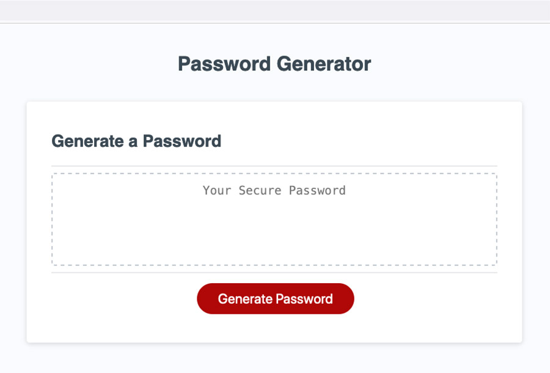
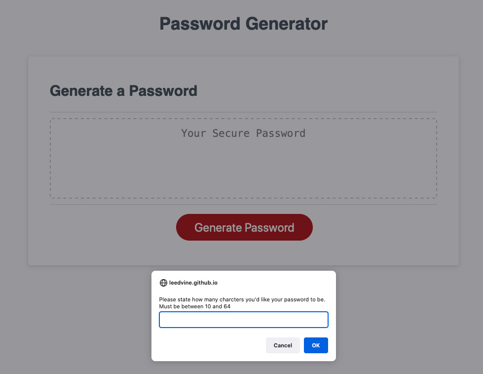

## Overview

Create an application that an employee can use to generate a random password based on criteria they’ve selected by modifying starter code. This app will run in the browser, and will feature dynamically updated HTML and CSS powered by JavaScript code that you write. It will have a clean and polished user interface that is responsive, ensuring that it adapts to multiple screen sizes.

It will allow show alerts of validation and errors, prompting the user to select appropriate criteria.

### Screenshot showing example of what user presented with

  

### Screenshot showing prompt

  

### Screenshot showing alert

  

### Screenshot showing final example of result expected

  

### Links

- Repo URL: https://github.com/leedvine/password-generator
  
- Live Site URL: https://leedvine.github.io/password-generator/

## My process

### Built with

- Use of Javascript variables, functions, While and For loops as well as maths and if conditions
  
### What I learned

Using prompts and alerts it is possible to direct a user through a process to give them a result based on their choices and adhearing to choice criteria.
  
By using While loops it insures that the user is presented with information (alerts) and the repetition of questions (confirms) to validate choices.
  
By using "if" statements and .concat method we can take confirmed data and build one array of validated criteria.

Using Math we can create a random set of characters from the above array.

  
### Useful resources
  
https://www.w3schools.com/jsref/met_win_prompt.asp
  
https://www.w3schools.com/jsref/met_win_alert.asp
  
https://developer.mozilla.org/en-US/docs/Web/JavaScript/Reference/Statements/while
  
https://developer.mozilla.org/en-US/docs/Web/JavaScript/Reference/Global_Objects/Math/random
  
## Author
  Lee Vine
- GitHub - https://github.com/leedvine

## Installation

Simplest way to view the project is on GitHub pages here https://leedvine.github.io/password-generator/

You can also download the files to your local environment from Github here https://github.com/leedvine/password-generator and right click the index file to open in browser.

It is also possible to download from the above link and instal on any hosting owned by yourself. Note this should only be done on unused / clean hosting account 

Installing in folders with the same name here can overwrite your existing files.

